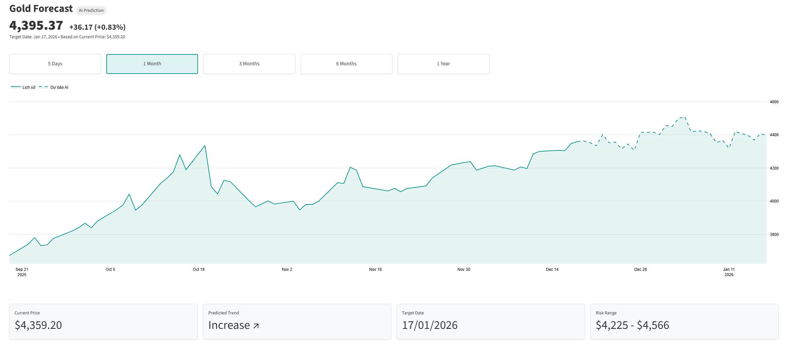
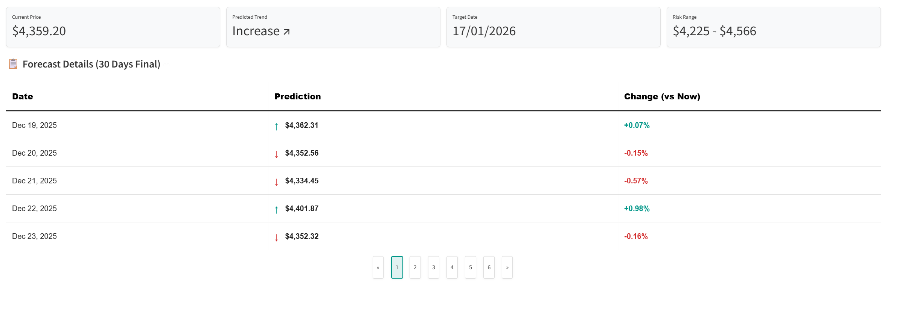

# 🪙 Gold Price Forecast System

A professional gold price forecasting system using a **Hybrid Deep Learning Model** that combines technical analysis (LSTM) with macroeconomic indicators (Dense Neural Network).

---

## 📋 Table of Contents
- [Overview](#overview)
- [Features](#features)
- [Tech Stack](#tech-stack)
- [Project Structure](#project-structure)
- [Setup & Configuration](#setup--configuration)
- [Usage](#usage)
- [Model Architecture](#model-architecture)
- [MLflow Integration](#mlflow-integration)
- [Evaluation Metrics](#evaluation-metrics)

---

## 🎯 Overview

This system predicts the **Minimum** and **Maximum** gold price changes for the next **30 days** using a hybrid approach:

| Branch | Input Type | Purpose |
|--------|------------|---------|
| **LSTM** | Time Series (Technical) | Learns patterns from historical price data |
| **Dense NN** | Static (Macro) | Captures macroeconomic influences |

---

## ✨ Features

- **Automated Data Fetching**: Yahoo Finance & FRED API
- **Hybrid Model Architecture**: LSTM + Dense Neural Network
- **Attention Mechanism**: Optional attention-based model for comparison
- **Backtesting**: Investment strategy simulation vs Buy & Hold
- **Experiment Tracking**: MLflow integration for reproducibility
- **30-Day Forecast**: Min/Max price range prediction

---

## 🛠️ Tech Stack

| Category | Technology |
|----------|------------|
| Language | Python 3.10+ |
| Deep Learning | TensorFlow / Keras |
| Data Processing | Pandas, NumPy, Scikit-learn |
| Data Sources | yfinance, fredapi |
| Experiment Tracking | MLflow |
| Visualization | Matplotlib |
| Configuration | PyYAML, python-dotenv |

---

## 📁 Project Structure

```
Gold-Forecast/
├── config/
│   └── settings.yaml          # Main configuration file
├── data/
│   ├── raw/                   # Raw data from APIs
│   ├── processed/             # Feature-engineered data
│   └── final/                 # Forecast outputs
├── artifacts/
│   ├── models/                # Saved Keras models & scalers
│   └── figures/               # Training/evaluation plots
├── src/
│   ├── data_loader/           # Data fetching modules
│   ├── processing/            # Feature engineering
│   ├── models/                # Model architectures
│   ├── training/              # Training pipeline
│   ├── prediction/            # Inference module
│   ├── evaluation/            # Performance metrics
│   ├── backtesting/           # Strategy simulation
│   └── visualization/         # Plotting utilities
├── main.py                    # CLI entry point
├── requirements.txt
└── README.md
```

---

## ⚙️ Setup & Configuration

### 1. Clone Repository
```bash
git clone https://github.com/your-repo/Gold-Forecast.git
cd Gold-Forecast
```

### 2. Create Virtual Environment
```bash
python -m venv venv
source venv/bin/activate  # Linux/Mac
# venv\Scripts\activate   # Windows
```

### 3. Install Dependencies
```bash
pip install -r requirements.txt
```

### 4. Configure Environment Variables
Create a `.env` file in the project root:
```env
FRED_API_KEY=your_fred_api_key_here
```
> Get your free API key from [FRED](https://fred.stlouisfed.org/docs/api/api_key.html)

### 5. Configure Model Settings
Edit `config/settings.yaml`:
```yaml
model:
  name: "Hybrid_Gold_Forecast_V1"
  type: "hybrid"  # Options: "hybrid" or "attention"
  hidden_dim: 64
  dropout: 0.2

training:
  epochs: 100
  batch_size: 32
  learning_rate: 0.001
  patience: 10
```

---

## 🚀 Usage

### Run Full Pipeline
```bash
python main.py pipeline
```

### Run Individual Steps
```bash
# Step 1: Fetch data from Yahoo Finance & FRED
python main.py fetch

# Step 2: Process and engineer features
python main.py process

# Step 3: Train the model
python main.py train

# Step 4: Evaluate model performance
python main.py evaluate

# Step 5: Generate 30-day forecast
python main.py predict

# Step 6: Run backtest simulation
python main.py backtest

# Step 7: Generate visualizations
python main.py visualize
```

---

## 🧠 Model Architecture

### Input Features

#### Technical Features (LSTM Input)
| Feature | Description |
|---------|-------------|
| `Gold_Close` | Daily closing price |
| `Log_Return` | Logarithmic returns for stationarity |
| `RSI` | Relative Strength Index (momentum) |
| `Volatility_20d` | 20-day rolling volatility |
| `Trend_Signal` | Price / SMA50 ratio |

#### Macro Features (Dense Input)
| Feature | Description |
|---------|-------------|
| `DXY` | US Dollar Index (inverse correlation with gold) |
| `US10Y` | 10-Year Treasury Yield |
| `CPI` | Consumer Price Index (inflation) |
| `Real_Rate` | Real interest rate (strongest factor) |

### Architecture Diagram
```
[Technical Data]          [Macro Data]
      │                        │
      ▼                        ▼
   ┌──────┐               ┌───────┐
   │ LSTM │               │ Dense │
   └──────┘               └───────┘
      │                        │
      └──────────┬─────────────┘
                 │
                 ▼
           ┌───────────┐
           │ Concatenate│
           └───────────┘
                 │
                 ▼
           ┌───────────┐
           │   Dense   │
           └───────────┘
                 │
        ┌───────┴───────┐
        ▼               ▼
   [Min Change]    [Max Change]
```

---

## 📊 MLflow Integration

### Start MLflow Dashboard
```bash
mlflow ui
# Open http://127.0.0.1:5000
```

### What Gets Logged
| Category | Items |
|----------|-------|
| Parameters | `model_type`, `epochs`, `batch_size`, `learning_rate` |
| Metrics | `loss`, `val_loss`, `MAE`, `RMSE`, `Accuracy`, `Sharpe` |
| Artifacts | `training_history.png`, Keras model |

### Compare Models
1. Select multiple runs in the UI
2. Click **Compare**
3. View side-by-side metrics

---

## 📈 Evaluation Metrics

| Metric | Description | Good Value |
|--------|-------------|------------|
| MAE | Mean Absolute Error | < 0.03 |
| RMSE | Root Mean Squared Error | < 0.04 |
| Accuracy | Direction prediction (UP/DOWN) | > 55% |
| Sharpe Ratio | Risk-adjusted returns | > 1.0 |
| Max Drawdown | Worst peak-to-trough loss | > -30% |

---

## 📝 License

MIT License

---

---

## 🖥️ User Interface Preview

The system features an intuitive dashboard designed to track gold price fluctuations and provide comprehensive future forecast insights.

### 📈 Gold Price Forecast Chart
The main interface visualizes historical gold price data alongside an AI-generated forecast (represented by a dotted line). It highlights several key indicators:
* **Predicted Trend**: Displays the expected upward or downward movement of the market (e.g., "Increase").
* **Risk Range**: Provides a calculated price safety interval based on model volatility (e.g., $4,225 - $4,566).
* **Target Date**: Indicates the estimated time for the forecast to reach its projected target.
* **Timeframe Selection**: Allows users to toggle views between 5 Days, 1 Month, 3 Months, 6 Months, and 1 Year.



### 📄 Forecast Details (30 Days Final)
This table offers a granular, daily breakdown of price projections and percentage shifts relative to current market values:
* **Date**: Lists the specific date for each projected data point.
* **Prediction**: Shows the precise price level forecasted by the hybrid model.
* **Change (vs Now)**: Displays the percentage variance compared to the live price at the time of execution (e.g., +0.07%).


